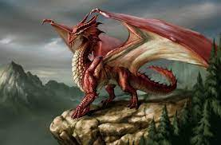
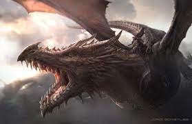

```{r setup, include=FALSE}
knitr::opts_chunk$set(echo = TRUE)
```

# Dragons Added
These are the images of Dragons that I added to the dataset for my assignment






Their traits were added to the data matrix in the input file

# Inital Setup
I will load in the data set and required packages
```{r}
library(ape)
library(reshape2)
library(ggplot2)
library(ggtree)
DragonNexus = read.nexus.data("Input/DragonMatrix.nex")
head(DragonNexus)
```

# Adjusting Weights
Now I will adjust the weights of the different traits

First I must get the weights from the project github
```{r}
WeightsDat = read.csv("Input/Weights.csv")
```

Now I will create a single vector of weights so that they can be effectively assigned
```{r}
Weights = paste0(WeightsDat$Weight, collapse = "")
Weights = strsplit(Weights, split = "")[[1]]
```

Now I will assign each letter a number value
```{r}
WeightsNum = rep(NA, length(Weights))
for(i in 1:length(WeightsNum)){
  if(Weights[i] %in% LETTERS){
    WeightsNum[i] = which(LETTERS==Weights[i]) + 9
  } else {
    WeightsNum[i] = Weights[i]
  }
}
WeightsNum = as.numeric(WeightsNum)
```

Now I will mulitply the weight value by the trait vector
```{r}
WtDragonNexus = DragonNexus
for(i in 1:length(DragonNexus)){
  RepWeight = DragonNexus[[i]]==1
  WtDragonNexus[[i]][RepWeight] = WeightsNum[RepWeight]
  RepWeight = NA
}
```

# Calculate Distance Matrix
Now I will calculate the distance matrix 
```{r}
WtDragonNexusDF = data.frame(matrix(unlist(WtDragonNexus), ncol = 78, byrow = T))
row.names(WtDragonNexusDF) = names(WtDragonNexus)
WtDragonDist = dist(WtDragonNexusDF, method = "euclidean")
WtDragonDistMat = as.matrix(WtDragonDist)
```

I will now plot this distance matrix
```{r}
WtPDat = melt(WtDragonDistMat)
ggplot(WtPDat, aes(x = Var1, y = Var2, fill = value)) +
  geom_tile() +
  scale_fill_gradientn(colours = c("white", "blue", "green","red")) +
    theme(axis.text.x = element_text(angle = 90, hjust = 1, vjust = 0.5))
```

# Plotting the Tree
Now I will plot the tree

```{r}
WtDragonTree = fastme.bal((WtDragonDist))
ggtree(WtDragonTree, layout = "circular")
```

Now I will clean up this basic tree and make it better to look at begging by adding names
```{r}
Country = gsub("[0-9\\.]+([^X]+)X*", "\\1", WtDragonTree$tip.label)
CountryGroups = split(WtDragonTree$tip.label, Country)
WtDTcol = groupOTU(WtDragonTree, CountryGroups)
```

With this done, the tree will now look better once I re-build it
```{r}
ggtree(WtDTcol, layout = "circular", aes(colour = group)) +
  geom_tiplab(size = 2, aes(angle = angle))
```

As you can see based on the above chart, two of the three dragons I have picked appear to be closely related, while, unsurprisingly, the third is distinct from the others. This is shown better by this version of the tree.
```{r}
ggtree(WtDTcol, layout = "circular", aes(colour = group)) +
  geom_tiplab(size = 2, aes(angle = angle)) +
  scale_colour_manual(values = c("grey", "grey", "red", "grey", "grey", "grey", "grey", "grey", "grey", "grey", "grey", "grey", "grey", "grey", "grey", "grey", "grey", "grey", "grey", "grey"))
```

